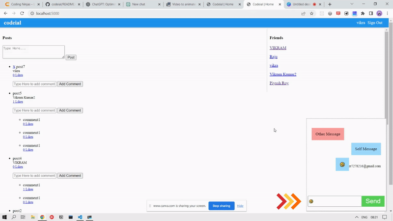
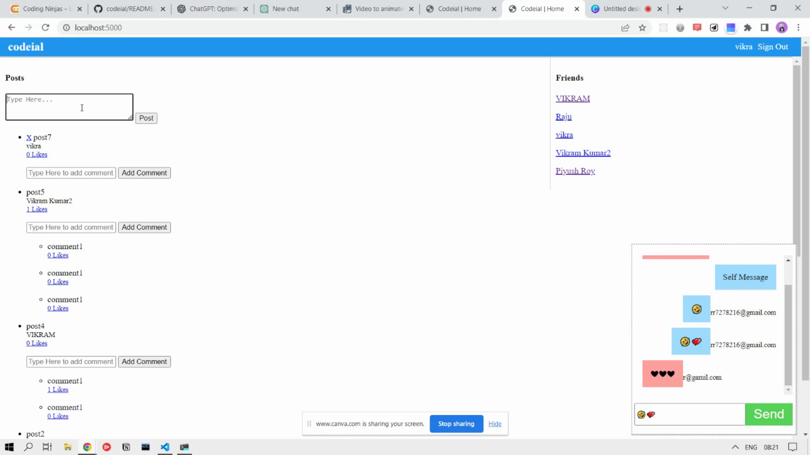

# Codeial

Codeial is a social media platform that allows users to create posts, comment on them, like them, and chat with friends. Users can also log in using their Google account.

This project was built using the MERN stack (MongoDB, Express.js, React.js, and Node.js) and also uses Passport.js for authentication, Redis for caching, and Gulp for task automation. Additionaly it is using packages such as connect-flash, connect-mongo, cookie-parser, crypto, del, ejs, express-ejs-layouts, express-session, gulp-cssnano, gulp-imagemin, gulp-rev, gulp-sass, gulp-uglify-es, jsonwebtoken, kue, mongoose, morgan, multer, node-sass, node-sass-middleware, nodemailer, passport-google-oauth, passport-jwt, passport-local, redis-server, rotating-file-stream, run-sequence, socket.io

## Getting Started

1. Clone the repository: `git clone https://github.com/<username>/codeial.git`
2. Install dependencies: `npm install`
3. Create a `.env` file with the following environment variables:
   - `MONGODB_URI`: the URI for your MongoDB database
   - `SESSION_SECRET`: a secret for encrypting session data
   - `GOOGLE_CLIENT_ID` and `GOOGLE_CLIENT_SECRET`: your Google OAuth client ID and secret
4. Start the development server: `npm run dev`
5. The application will be available at `http://localhost:3000`

## Deployment

To deploy the application, you will need to set up a production environment with a MongoDB database and a Redis server. You can then build the client-side code with `npm run build` and start the server with `npm start`.

## Features

- Create and view posts
- Comment on posts
- Like posts
- Chat with friends
- Login with Google

## Technologies Used
- MERN stack
- Passport.js
- Redis
- Gulp
- connect-flash, connect-mongo, cookie-parser, crypto, del, ejs, express-ejs-layouts, express-session, gulp-cssnano, gulp-imagemin, gulp-rev, gulp-sass, gulp-uglify-es, jsonwebtoken, kue, mongoose, morgan, multer, node-sass, node-sass-middleware, nodemailer, passport-google-oauth, passport-jwt, passport-local, redis-server, rotating-file-stream, run-sequence, socket.io

## Additional Resources

- [MERN Stack Guide](https://blog.logrocket.com/mern-stack-a-guide-to-setting-up-a-full-stack-react-redux-app-using-mongodb-express-js-react-js-and-node-js/)
- [Passport.js](http://www.passportjs.org/)
- [Redis](https://redis.io/)
- [connect-mongo](https://www.npmjs.com/package/connect-mongo)
- [cookie-parser](https://www.npmjs.com/package/cookie-parser)
- [crypto](https://nodejs.org/api/crypto.html)
- [del](https://www.npmjs.com/package/del)
- [ejs](https://www.npmjs.com/package/ejs)
- [express-ejs-layouts](https://www.npmjs.com/package/express-ejs-layouts)
- [express-session](https://www.npmjs.com/package/express-session)
- [gulp-cssnano](https://www.npmjs.com/package/gulp-cssnano)
- [gulp-imagemin](https://www.npmjs.com/package/gulp-imagemin)
- [redis-server](https://www.npmjs.com/package/redis-server)
- [rotating-file-stream](https://www.npmjs.com/package/rotating-file-stream)
- [run-sequence](https://www.npmjs.com/package/run-sequence)

## Screenshot

  

## Contributing

We welcome contributions to Codeial. If you want to help out, please open a pull request with your changes.
